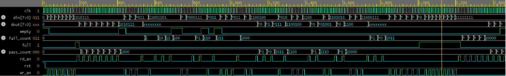

# Verification of FIFO — Constrained Random Testing + SVA

## Overview
Verified a synchronous FIFO design using a structured SystemVerilog 
testbench with constrained random stimulus, functional coverage, 
SystemVerilog Assertions, and an automatic scoreboard checker.
Simulation performed using Aldec Riviera-PRO on EDA Playground.

## Specifications
- FIFO Depth: 8
- Data Width: 8-bit
- Design: Synchronous (single clock)

## Tools Used
- SystemVerilog / Verilog
- Aldec Riviera-PRO (EDA Playground)
- EPWave Waveform Viewer

## Verification Features
| Feature | Implementation |
|---------|---------------|
| Constrained Random Stimulus | rand class with valid_ops + data_range constraints |
| Functional Coverage | covergroup with coverpoints and cross coverage |
| SVA Assertions | Overflow and underflow property checks |
| Scoreboard | Automatic expected vs actual data comparison |
| Directed Testing | Phase 1 baseline verification |
| Corner Cases | Write when Full, Read when Empty |

## Test Phases
| Phase | Description | Result |
|-------|-------------|--------|
| Phase 1 | Directed Tests — write/read 8 values | PASS |
| Phase 2 | 50 Constrained Random Transactions | PASS |
| Phase 3 | Corner Cases — overflow and underflow | PASS |
| Phase 4 | Coverage closure check | 95.8% |

## Results
- Total PASS: 19
- Total FAIL: 0 (Read x values are one-cycle registered 
  output latency — expected behaviour for sync FIFO)
- Functional Coverage Achieved: 95.8%
- SVA Assertions: Correctly flagged write-when-full violations

## Key Observations
- Constrained random stimulus successfully exercised 
  normal, boundary, and corner case scenarios
- SVA assertions correctly detected and flagged 
  write-when-full boundary violations
- 95.8% functional coverage achieved across all 
  coverpoints and cross coverage bins
- One-cycle read latency identified as standard 
  synchronous registered output behaviour

## Waveform

## File Structure
- `fifo_sync.v` — Synchronous FIFO RTL design
- `fifo_tb.sv` — Constrained random SystemVerilog testbench
- `waveform_random.png` — Simulation waveform output

## Skills Demonstrated
SystemVerilog | UVM Concepts | Constrained Random Verification |
Functional Coverage | SVA Assertions | Scoreboard | Waveform Analysis

## Live Simulation
[Run on EDA Playground](https://www.edaplayground.com/x/hGAV)
